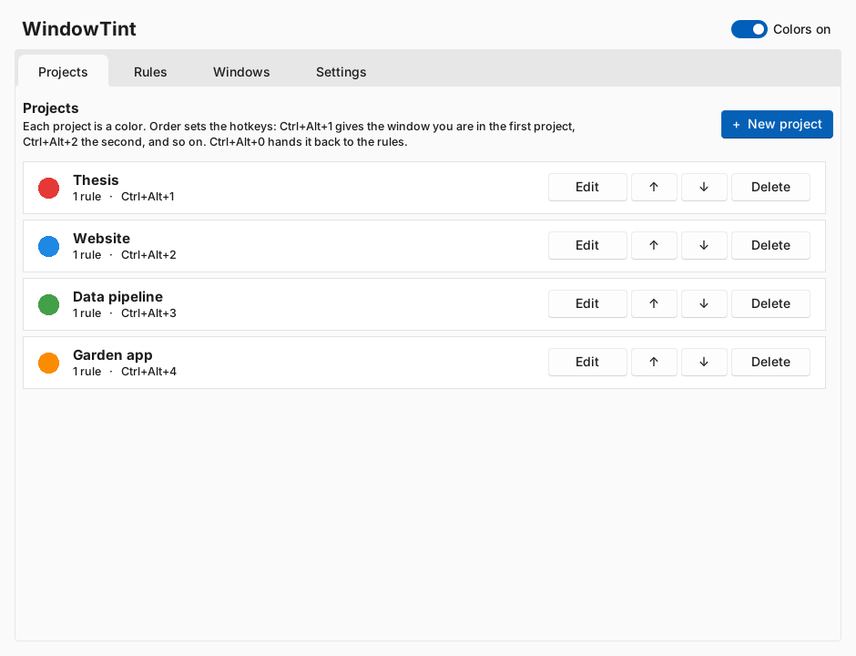
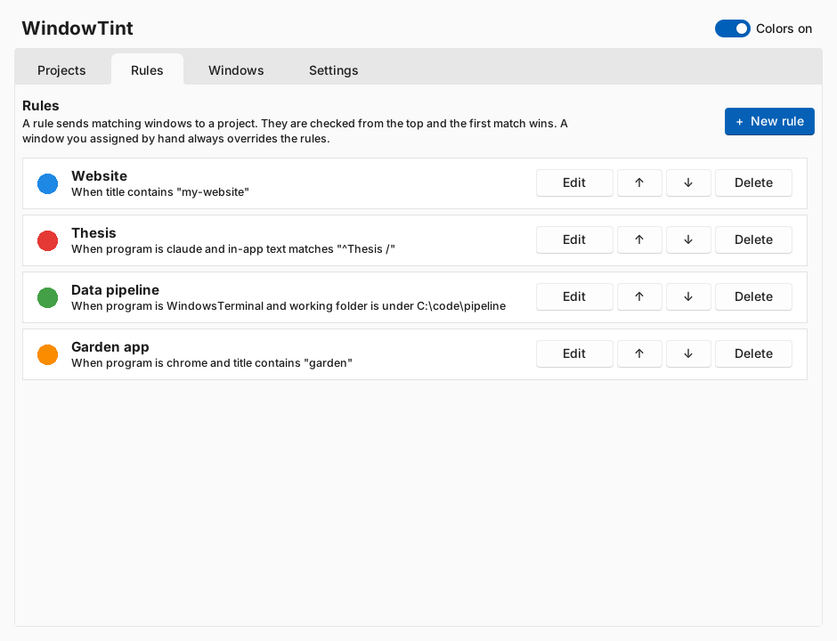
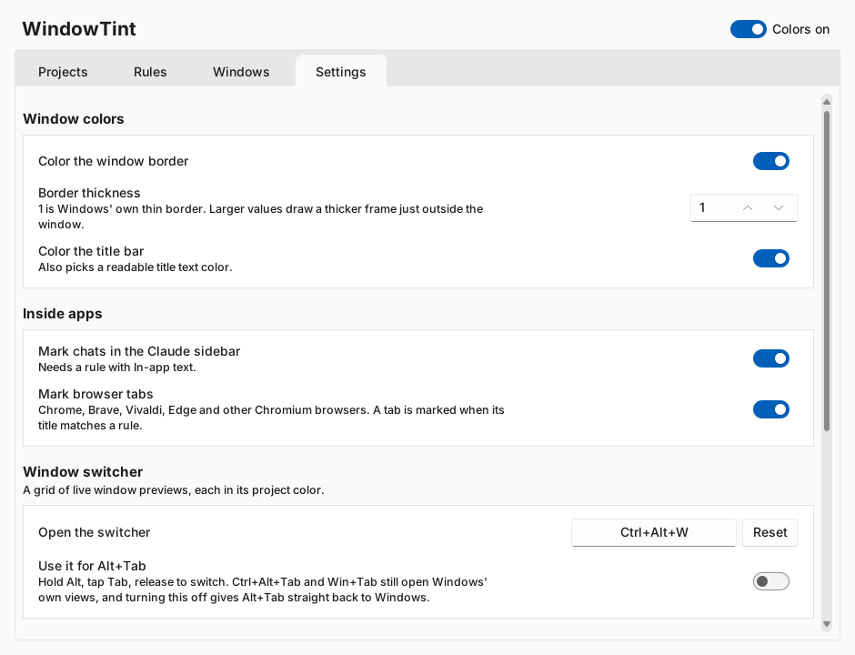
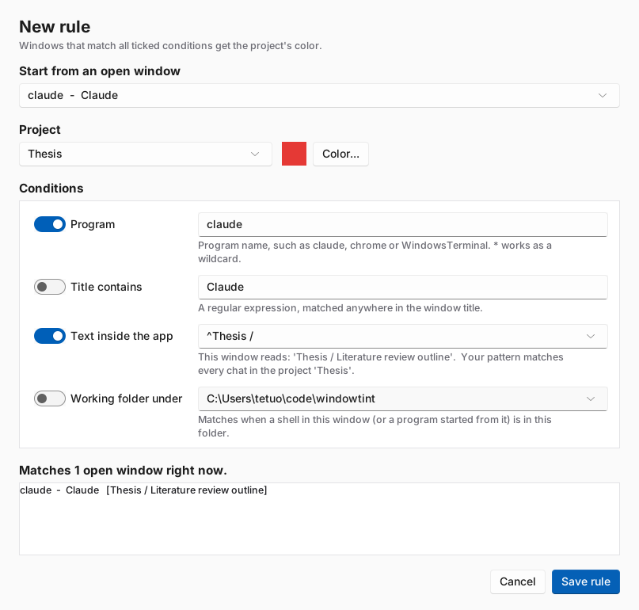
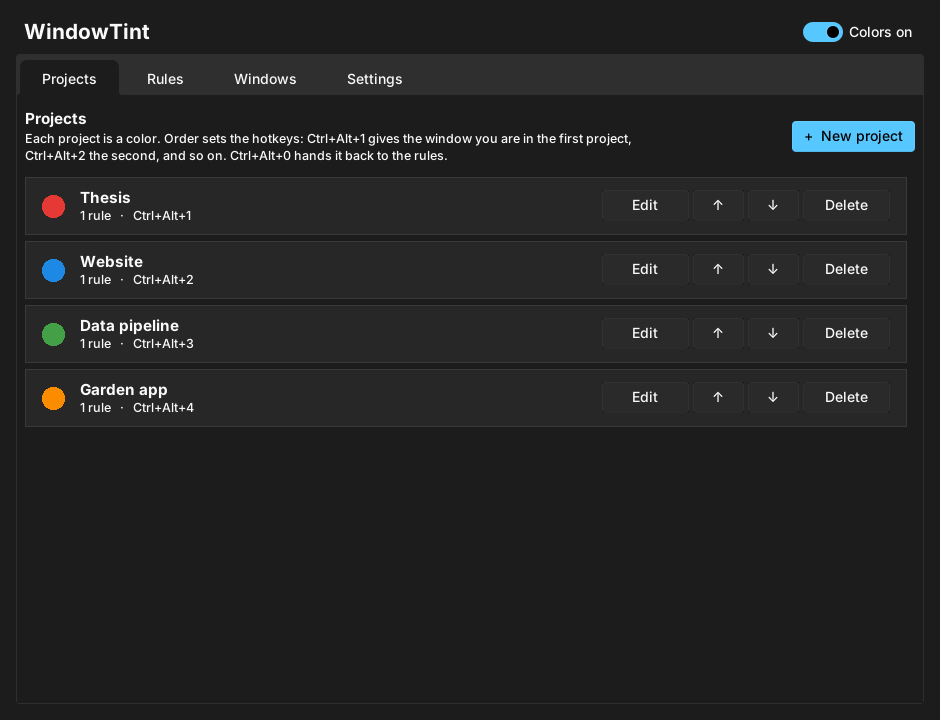

# WindowTint

**Tell your projects apart at a glance.** WindowTint colors each window's border and title bar by project, so the terminal, browser, editor and Claude chat that belong to one project all share a color, and every window of another project looks different.

<!-- MEDIA SLOT: add docs/images/hero.png (a desktop with 3-4 windows in different project colors) and uncomment:

-->

Windows 11 only (build 22000+). Python 3.10+.

## Features

- Per-project colors on window borders and title bars (border thickness 1 to 8 px)
- Rules by program, window title, working folder (terminals) or text read from inside the Claude desktop app
- Hotkeys to assign the focused window to a project (`Ctrl+Alt+1`..`9`)
- Colored marks on every chat in the Claude sidebar and on browser tabs (Chrome, Edge, Brave, Vivaldi)
- Window switcher (`Ctrl+Alt+W`) and optional Alt+Tab replacement: a grid of live previews outlined in project colors
- Modern light and dark settings window that follows Windows' theme
- Tray app; quitting restores every window's normal colors

## Screenshots

The settings window (rendered from the app's real UI code with the real theme; see the note below):

| Projects | Rules |
|---|---|
|  |  |
|  |  |



> Note: the images above were rendered on Linux, not captured on Windows, so the title bar differs slightly. Replace them with real captures if you like.

### Demos (to add)

<!-- Add these to `docs/images/` and uncomment the lines. A suggested capture checklist is at the end of this file. -->


#### Claude Conversation Tint


<!--


-->

## Install

```bat
git clone https://github.com/well-noted/WindowTint.git
cd WindowTint
run.bat
```

`run.bat` installs the dependencies from `requirements.txt` (psutil, pystray, Pillow, uiautomation, sv-ttk) and starts the tray icon. For a standalone exe, run `build.bat` (uses PyInstaller, output `dist\WindowTint.exe`).

Right-click the tray icon to open Settings, the switcher, or to quit.

## Quick start

1. Settings > Projects > **New project**: name it and pick a color.
2. Focus a window and press `Ctrl+Alt+1` to give it the first project's color, or press `Ctrl+Alt+R` to build a rule from that window so similar windows are colored automatically.
3. Optional: Settings > Settings, turn on the Alt+Tab replacement, and adjust the border thickness.

## Assigning windows

- **Hotkeys:** with a window focused, press `Ctrl+Alt+1` to `Ctrl+Alt+9` to assign it to project 1 to 9 (order shown in Settings > Projects). `Ctrl+Alt+0` returns it to automatic rules.
- **New rule from a window:** press `Ctrl+Alt+R` (changeable in Settings > Settings) with a window focused (or select it on the Settings > Windows tab and click "Make rule from selected window..."). The rule editor opens with the program, in-app text (Claude app) or folder (terminals) filled in. Tick which conditions to use, choose a project or type a new project name with a color, and see how many open windows the rule matches before saving. Add and Edit on the Rules tab use the same editor, and it has a window picker.
- **Window switcher:** press `Ctrl+Alt+W` by default (change it in Settings > Settings; or choose "Window switcher" in the tray menu) for a grid of cards like Windows' Ctrl+Alt+Tab view: a live preview of each window, its icon and title, and a chip and outline in the project's color. Type to filter, arrow keys or Tab to move, Enter or a click to switch, Esc to close. It starts on the previous window, like Alt+Tab. Cards shrink as windows are added, and minimized windows show their icon instead of a preview.
- **Alt+Tab replacement (optional):** turn on "Use WindowTint's switcher for Alt+Tab" in Settings > Settings, or from the tray menu. Hold Alt, tap Tab to cycle (Shift+Tab goes back, arrow keys move across the grid), release Alt to switch, Esc to cancel. A quick Alt+Tab tap switches to the previous window without drawing anything. Ctrl+Alt+Tab and Win+Tab stay with Windows. The keyboard hook is installed only while the option is on, and Windows gets Alt+Tab back immediately if WindowTint stops responding. Windows running as administrator do not pass keys to WindowTint, so Alt+Tab there is Windows' own.
- **Tray menu:** right-click the tray icon > "Assign last active window to" > project. Also has "Auto (use rules)" and "No color for this window".
- **Rules:** Settings > Rules. A rule can match a window title (regex), a process name (glob such as `chrome` or `Code*`), and/or a folder prefix. Filled fields must all match; rules are checked top to bottom and the first match wins. A manual assignment overrides rules.
- **Folder rules** look at the working directory of the window's process and all its child processes. This is how a terminal in `C:\code\my-repo` gets the right color even though its title doesn't say so.

- **In-app text rules (Claude desktop app):** the app's window title is always "Claude", so a rule can instead match text read from inside the window through Windows UI Automation. The text is `Project / Chat title` for a chat inside a project, or just `Chat title` otherwise. Example rule: Process `claude`, In-app text `^Netlogo Improvements /`. The window then takes that project's color whenever one of its chats is open, and changes when you switch chats. A rule with In-app text needs a Process. Settings > Windows has an "In-app text" column showing exactly what was read for each window, which is the quickest way to write a rule.

- **Sidebar chat marks (Claude desktop app):** every chat row in the Claude sidebar gets a solid bar on its left edge and a light tint in its project's color. The color comes from the same rules: each row is tested as `Project / Chat title` (or just `Chat title` for chats outside a project), so the rule `Process claude` + `In-app text ^Netlogo Improvements /` colors every chat in that sidebar project. Chats that match no rule get no mark. Turn this off with "Mark each chat in the Claude sidebar" in Settings > Settings.

Settings > Windows shows every open window with its current project and where that came from (manual or rule), and lets you assign from there.

## Browser tabs

Chrome, Brave, Vivaldi, Edge and other Chromium browsers get a colored bar across the top of each tab whose title matches a rule (Settings > General turns this off). Tab rules use the "Window title contains" and "Program" fields; a rule that uses In-app text or Working folder does not apply to tabs. The tab strip is read through UI Automation, so if no tabs are marked, run `python dump_tabs.py` and share `tabs_dump.txt`.

## Files

Config is `%APPDATA%\WindowTint\config.json`; manual assignments are in `state.json` beside it. (If Python came from the Microsoft Store, Windows may redirect that folder under `%LOCALAPPDATA%\Packages\...`.)

## Known limits

- Windows Terminal, Chrome, VS Code, and other apps that draw their own title bar ignore the title bar color; they still get the colored border. Maximized windows show no border, so only apps with a standard title bar show color then.
- Windows Terminal puts all tabs in one window. A folder rule matches if any tab's shell is in the folder, so mixed tabs can't be told apart. Title rules are more precise when your shell sets the title.
- Windows running as administrator can reject color changes unless WindowTint is also run as administrator.
- A window has one color, so the border cannot highlight a single conversation in the sidebar; it follows whichever chat is open. With two chats from different projects in two Claude windows, each window gets its own color.
- In-app text relies on the Claude app's accessibility tree (English interface labels are not needed, but the header layout is). An app update that changes the header could stop the project name from being read; the chat title is read from the page title and is more stable. `dump_claude_tree.py` and `probe_claude.py` are diagnostics for this.
- Reading in-app text turns on Chromium's accessibility mode inside the Claude app while WindowTint runs, which can use a little more CPU there. It is only active when at least one rule uses In-app text.
- Sidebar marks are drawn as click-through windows owned by the Claude window, so they sit just above it, hide when it is minimized, and are covered by windows in front of it. They follow scrolling and window moves with a short lag (a fraction of a second). If Windows refuses the owner relationship, the marks fall back to showing only while Claude is the active window. To test the drawing alone, run `python overlay.py --demo`.
- The marks depend on the sidebar's accessibility structure (verified against one version of the app). If they do not appear, `%APPDATA%\WindowTint\uia.log` records read errors; send it along with a fresh `dump_claude_tree.py` output.
- Border thickness 1 uses Windows' own border. Above 1, WindowTint draws a rounded frame just outside the window with a click-through overlay; it follows moves and resizes with a brief lag, and is hidden while the window is maximized or minimized.


## Troubleshooting

- Settings window looks old-fashioned: `pip install sv-ttk`.
- Odd switcher behavior: set the environment variable `WINDOWTINT_DEBUG=1` and restart; a log is written to the WindowTint folder in AppData.
- Tabs or sidebar marks missing: run the scripts in `tools/` (for example `python tools/dump_tabs.py`) and open an issue with the output.

## Tests

`python -m unittest discover -s tests` runs the logic tests with a fake Windows layer, on any OS. The Windows API calls themselves (hooks, DWM, UI Automation) are only exercised by running the app on Windows.

## Project layout

- `src/` application code (`engine.py` core, `rules.py` matching, `settings_ui.py`/`rule_editor.py`/`theme.py`/`widgets.py` UI, `switcher*.py` and `alttab_hook.py` switcher, `overlay.py`/`frame_overlay.py` overlays, `uia.py` UI Automation, `winapi.py` Windows calls)
- `tests/` unit tests; `tools/` diagnostic scripts; `docs/images/` README media

## Contributing

Issues and pull requests are welcome. Please run the tests first.

## License

MIT, see [LICENSE](LICENSE). Copyright (c) 2026 Thomas E. Tuoti ([@well-noted](https://github.com/well-noted)).

## Appendix: media capture checklist

1. `hero.png`: arrange 3-4 windows (terminal, browser, editor, Claude) in different project colors.
2. `colored-windows.gif`: press `Ctrl+Alt+1`, `2`, `3` on a window and show the color change.
3. `switcher.gif`: hold Alt, tap Tab a few times, release.
4. `claude-sidebar.png`: Claude app with colored sidebar chat marks.
5. `browser-tabs.png`: browser with colored tab bars.
6. `make-rule.gif`: `Ctrl+Alt+R`, tick conditions, save.
7. `border-thickness.gif`: change thickness 1 to 6 in Settings.

Tools such as ScreenToGif or ShareX work well.
